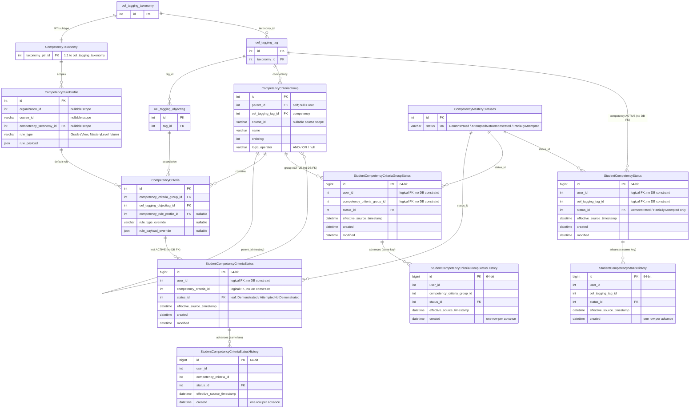

# Competency data model (updated)

The authoritative data model for CBE competency criteria and learner mastery. It builds on the
original `images/CompetencyCriteriaModel.png` overview, corrected against ADRs 0001-0003 (which are
the source of truth where the PNG diverges) and updated for the storage decisions in
`0005-competency-mastery-storage.rst`.

Notable differences from the PNG:

- Each learner-status level is now two tables: an **ACTIVE** table (one current row per learner and
  node, updated in place) and an append-only **HISTORY** table (one row per genuine status advance,
  bounded by monotonicity). The PNG showed a single table per level.
- The `mastery_level_id` column the PNG drew on `StudentCompetencyCriteriaStatus` is **not** part of
  the model (mastery level is a future rule type; see ADR 0002).
- Learner-status tables use 64-bit primary keys and are reachable through a dedicated database alias
  (defaulting to the main database). Their references to the definition tables and to the user are
  **logical foreign keys without database-level constraints**, so the tables can live in a separate
  database (see ADR 0005).

Existing tagging tables (`oel_tagging_*`) are shown minimally, only enough to anchor the
relationships they participate in.

Notes on the diagram:

- Each ACTIVE table is **unique on `(user_id, node_id)`** (one current row per learner and node):
  `(user_id, competency_criteria_id)`, `(user_id, competency_criteria_group_id)`, and
  `(user_id, oel_tagging_tag_id)` respectively. HISTORY tables have no such uniqueness; they carry
  one row per advance.
- The ACTIVE-to-HISTORY relationship is drawn as one-to-many but is not a literal foreign key: a
  HISTORY row shares the ACTIVE row's `(user_id, node_id)` identity rather than pointing at its
  primary key.
- `status_id` references the shared `CompetencyMasteryStatuses` lookup so status semantics live in
  one place.
