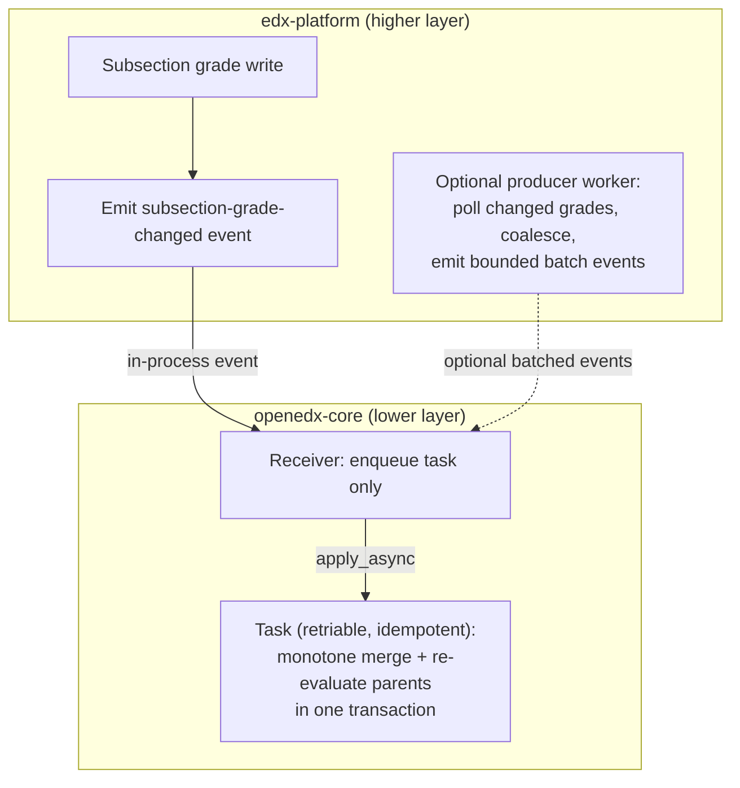
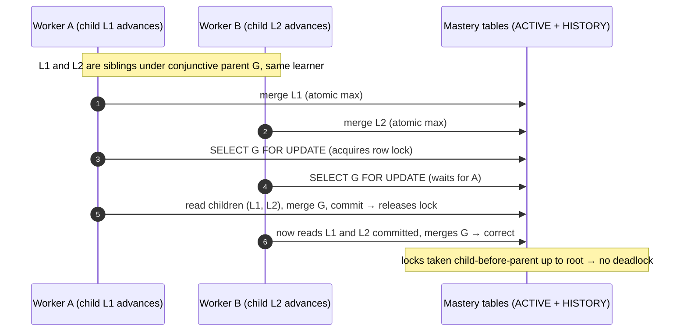
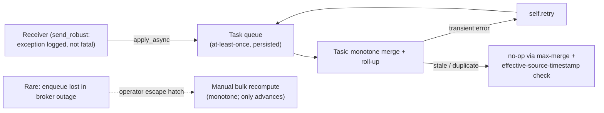

# ADR 0004 diagrams: competency mastery recording and concurrency

Companion diagrams for `0004-competency-mastery-concurrency.rst`. They are kept here as Markdown so
they render natively on GitHub; they are not part of the Sphinx/readthedocs build. Refer to the ADR
for the authoritative decision text.

## 1. Entry point and durable hand-off

edx-platform emits a subsection-grade-changed event; an openedx-core receiver only enqueues an
idempotent, retriable task, and that task does the monotone merge and re-evaluates the parents. The
thin receiver plus retriable task is edx-platform's own grade-recompute pattern, and it is what makes
a dropped in-process signal survivable. Batching (the dashed producer) is optional (decision 6).

## 2. Why it is correct: one transaction, monotone merge, brief per-node row lock

Every write is `status := max(stored, computed)`, so writes commute, repeat harmlessly, and never
regress. A leaf is a single value, so its atomic merge needs no extra lock. A conjunctive parent is
computed by reading several children first, so recomputing it takes a brief `SELECT ... FOR UPDATE`
on the parent row: two updates that touch the same parent for the same learner take turns, and the
second reads the first's committed children and computes from the complete picture. This is an
ordinary single-row lock, not the deployment-wide lock the previous design used.

## 3. Recovering a lost delivery: retriable task, not a re-scan

The in-process event can be dropped silently (``send_robust`` catches and logs a receiver
exception). Durability follows edx-platform's grades pattern: the receiver only enqueues, and the
task queue's at-least-once delivery plus task retries plus the monotone merge's idempotency carry the
work through. No scheduled reconciliation sweep; a genuine loss (enqueue failed during a broker
outage) is recovered by an operator-run bulk recompute, exactly as edx-platform recovers a missed
grade recompute.

