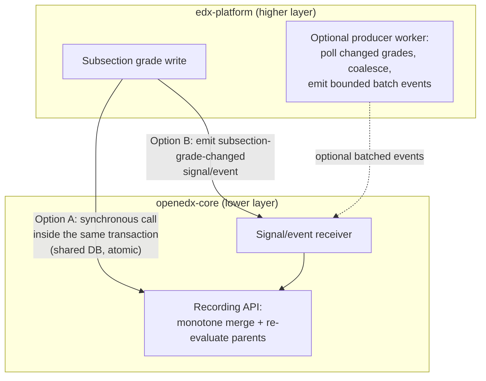
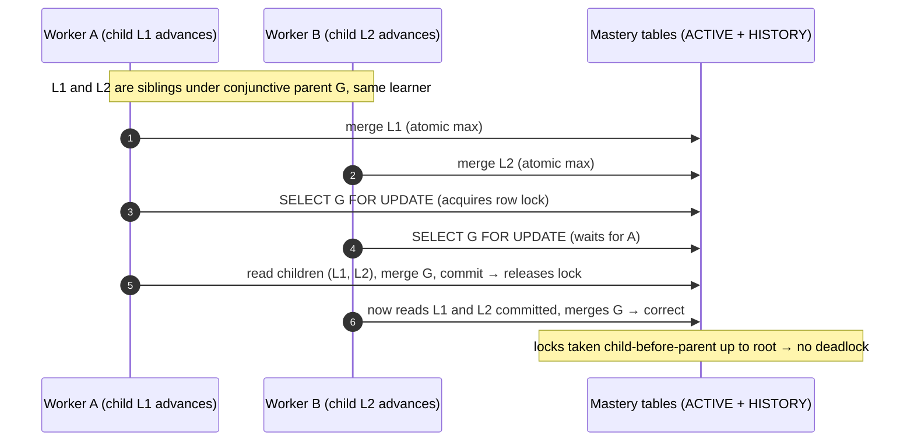
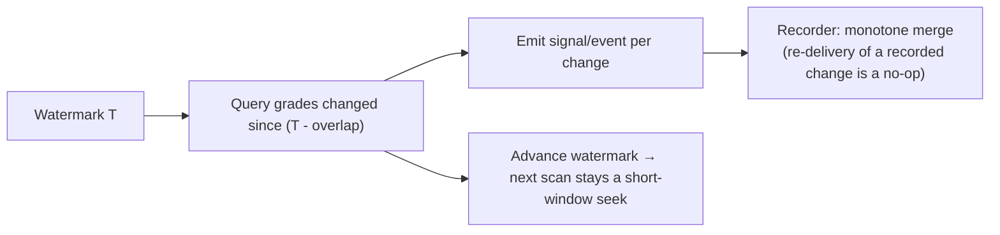

# ADR 0004 diagrams: competency mastery recording and concurrency

Companion diagrams for `0004-competency-mastery-concurrency.rst`. They are kept here as Markdown so
they render natively on GitHub; they are not part of the Sphinx/readthedocs build. Refer to the ADR
for the authoritative decision text.

## 1. Entry points: two options (no preference)

Both options push a grade change from edx-platform into openedx-core, which records it with a
monotone merge and re-evaluates the parents. They differ only in where the leaf write happens and
whether it is atomic with the grade write. Batching (the dashed producer) is optional and applies to
Option B.

## 2. Why it is correct: one transaction, monotone merge, brief per-node row lock

Every write is `status := max(stored, computed)`, so writes commute, repeat harmlessly, and never
regress. A leaf is a single value, so its atomic merge needs no extra lock. A conjunctive parent is
computed by reading several children first, so recomputing it takes a brief `SELECT ... FOR UPDATE`
on the parent row: two updates that touch the same parent for the same learner take turns, and the
second reads the first's committed children and computes from the complete picture. This is an
ordinary single-row lock, not the deployment-wide lock the previous design used.

## 3. Recovering a lost delivery (Option B): trailing-overlap re-scan

Option A cannot lose a change (mastery shares the grade transaction). Option B carries it over an
in-process signal that can be dropped silently. The producer re-reads a short overlap window behind
its watermark each cycle, so a dropped change is re-emitted next cycle; the monotone merge makes the
re-delivery a no-op if it was already recorded. No reconciliation command and no correcting sweep.

