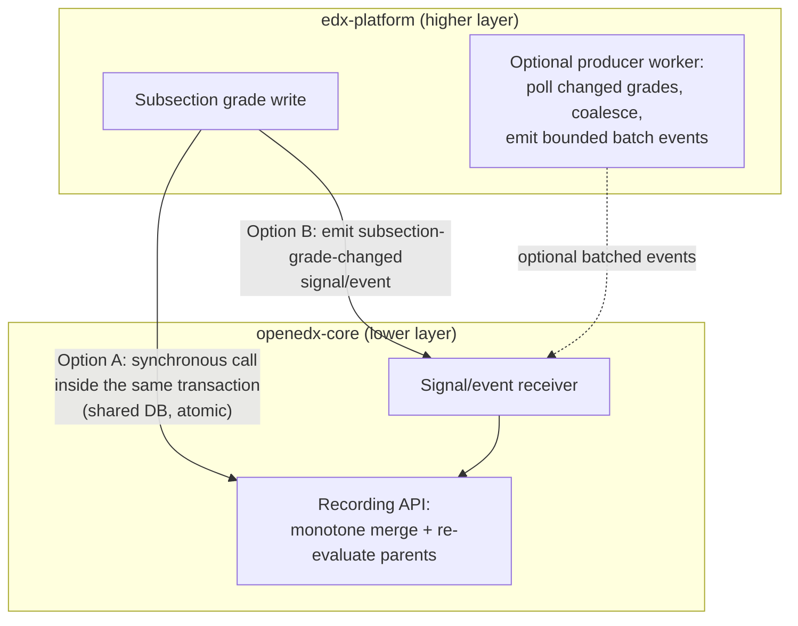
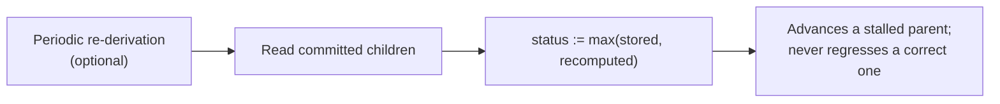

# ADR 0004 diagrams: competency mastery recording and concurrency

Companion diagrams for `0004-competency-mastery-concurrency.rst`. They are kept here as Markdown so
they render natively on GitHub; they are not part of the Sphinx/readthedocs build. Refer to the ADR
for the authoritative decision text.

## 1. Entry points: two options (no preference)

Both options push a grade change from edx-platform into openedx-core, which records it with a
monotone merge and re-evaluates the parents. They differ only in where the leaf write happens and
whether it is atomic with the grade write. Batching (the dashed producer) is optional and applies to
Option B.



## 2. Why it is correct without a lock

Every write is `status := max(stored, computed)`, so writes commute, repeat harmlessly, and never
regress. A conjunctive parent computed from a stale sibling view can be too low but never too high;
the re-evaluation triggered by the last child to commit reads every committed sibling and merges the
parent up to the correct value. Result: eventually correct, never over-stated, no coordination.

```mermaid
sequenceDiagram
    autonumber
    participant WA as Worker A (child L1)
    participant WB as Worker B (child L2)
    participant DB as Mastery tables (ACTIVE + HISTORY)

    Note over WA,WB: L1 and L2 are siblings under conjunctive parent G
    WA->>DB: merge L1 up; commit
    WB->>DB: merge L2 up; commit (last committer)
    WA->>DB: re-evaluate G from committed children<br/>(sees L1 new, L2 maybe stale) → may be too low
    WB->>DB: re-evaluate G from committed children<br/>(sees L1 and L2 committed) → correct
    Note over DB: max-merge keeps the higher value → G converges to correct, never over-stated
```

## 3. Optional monotone backstop

The only way step 2 leaves a parent low is a lost re-evaluation trigger. A periodic monotone
re-derivation repairs that: because it can only advance a status, it fixes a stalled parent without
ever corrupting one. It is not a correcting reconciliation (which a non-monotone design would need),
and can be omitted until lost triggers are actually observed.


