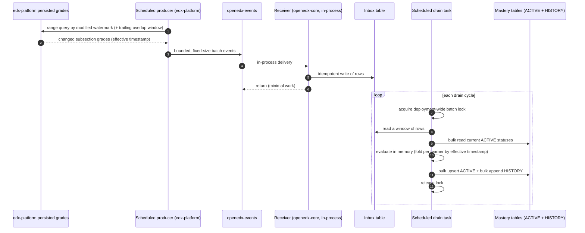
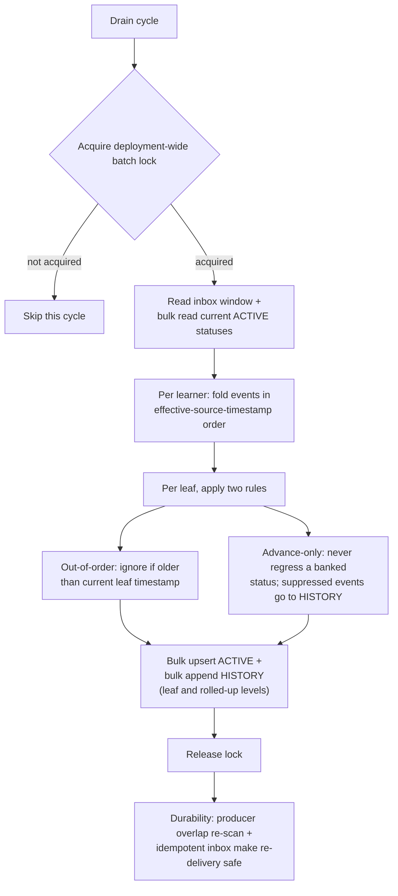

# ADR 0004 diagrams: competency mastery recording and concurrency

Companion diagrams for `0004-competency-mastery-concurrency.rst`. They are kept here as Markdown so
they render natively on GitHub; they are not part of the Sphinx/readthedocs build. Refer to the ADR
for the authoritative decision text.

## 1. End-to-end recording pipeline

A scheduled producer on the edx-platform side reads changed subsection grades and emits bounded
batch events. openedx-core receives them in-process, writes them idempotently into an inbox, and
returns. A separate scheduled task drains the inbox in windowed micro-batches under a single
deployment-wide lock, doing bulk reads and bulk writes.

## 2. Batch drain: correctness and performance

The lock serializes whole batches (not rows), so no two workers evaluate the same learner at once
and the same-learner write-skew cannot occur. Writes are bulk, so the higher per-batch row count of
stored leaves adds bulk-write time within a batch rather than per-row overhead or lock contention
between batches.

