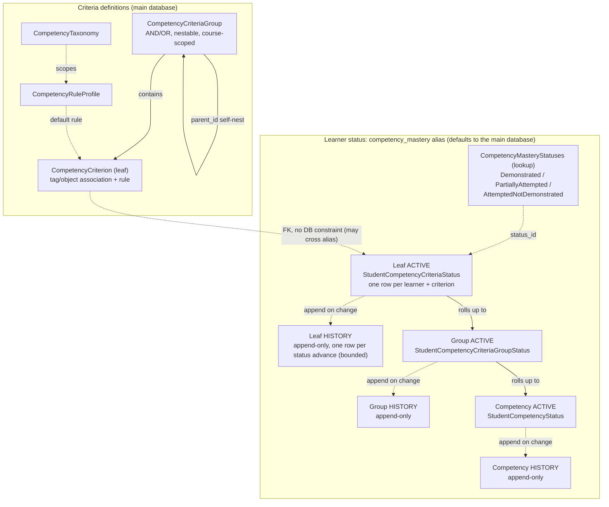
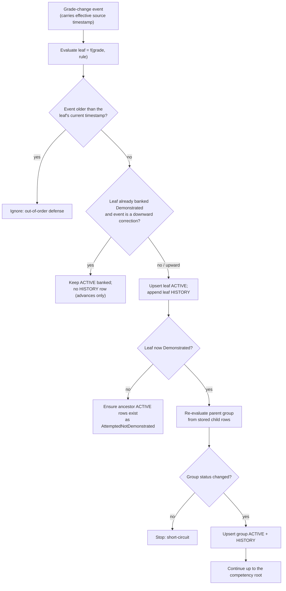

# ADR 0005 diagrams: competency mastery storage

Companion diagrams for `0005-competency-mastery-storage.rst`. They are kept here as Markdown so
they render natively on GitHub; they are not part of the Sphinx/readthedocs build. Refer to the ADR
for the authoritative decision text.

## 1. Data model and the ACTIVE/HISTORY split

Criteria definitions live in the main database. Learner status is stored at every level (leaf,
group, competency), each split into an ACTIVE table (current status, updated in place) and an
append-only HISTORY table. All learner-status tables are assigned to a dedicated `competency_mastery`
database alias through a router; that alias defaults to the main database, so a stock deployment runs
on one database and a large deployment can point the alias at a separate database with no migration.
Foreign keys that could cross the alias boundary are declared without database-level constraints.

## 2. Recording a grade change: incremental roll-up with banking

A grade-change event resolves the criteria fed by the subsection, evaluates the leaf as a pure
function of the grade and the rule, applies the out-of-order and advance-only rules, then rolls the
result up the tree, writing only the rows whose status changed.

## 3. Status lifecycle for a node (advance-only)

A node advances through statuses and is banked once Demonstrated: it never auto-regresses, so late
or duplicate events are safe. A leaf is atomic, so it only ever uses NotStarted (absent row),
AttemptedNotDemonstrated, or Demonstrated; PartiallyAttempted is a group-level state.

```mermaid
stateDiagram-v2
    [*] --> NotStarted: no row
    NotStarted --> AttemptedNotDemonstrated: first unsuccessful attempt
    AttemptedNotDemonstrated --> PartiallyAttempted: some children attained (AND / mixed groups)
    AttemptedNotDemonstrated --> Demonstrated: logic satisfied
    PartiallyAttempted --> Demonstrated: logic satisfied
    Demonstrated --> Demonstrated: banked; downward corrections write no HISTORY row
    note right of Demonstrated
        Advance-only: never auto-regresses.
        Competency level surfaces only
        Demonstrated / PartiallyAttempted.
    end note
```

